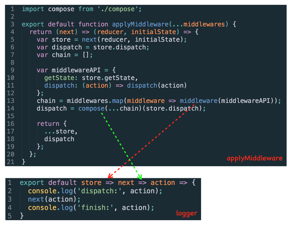

# redux_middleware详解

## 为什么dispatch需要middleware

上图表达的是 redux 中一个简单的同步数据流动的场景，点击 button 后，在回调中 dispatch 一个 action，reducer 收到 action 后，更新 state 并通知 view 重新渲染。单向数据流，看着没什么问题。但是，如果需要打印每一个 action 信息用来调试，就得去改 `dispatch` 或者 `reducer` 代码，使其具有打印日志的功能；又比如点击 `button` 后，需要先去服务器请求数据，只有等拿到数据后，才能重新渲染 `view`，此时我们又希望 `dispatch` 或者 `reducer` 拥有异步请求的功能；再比如需要异步请求完数据后，打印一条日志，再请求数据，再打印日志，再渲染...

面对多种多样的业务需求，单纯的修改 `dispatch` 或 `reducer` 的代码显然不具有普世性，我们需要的是可以组合的，自由插拔的插件机制，这一点 `redux` 借鉴了 `koa` 里中间件的思想，`koa` 是用于构建 web 应用的 `NodeJS` 框架。另外 `reducer` 更关心的是数据的转化逻辑，所以 `redux` 的 `middleware` 是为了增强 `dispatch` 而出现的。

上面这张图展示了应用 middleware 后 redux 处理事件的逻辑，每一个 middleware 处理一个相对独立的业务需求，通过串联不同的 middleware，实现变化多样的的功能。那么问题来了：

    * middleware 怎么写？
    * redux 是如何让 middlewares 串联并跑起来的？

## 理解middleware机制

redux 提供了 applyMiddleware 这个 api 来加载 middleware，为了方便理解，下图将两者的源码放在一起进行分析。

图下边是 logger，打印 action 的 middleware，图上边则是 applyMiddleware 的源码，applyMiddleware 代码虽然只有二十多行，却非常精炼，接下来我们就分四步来深入解析这张图。

*  第一步：函数式编程思想设计 middleware

    middleware 的设计有点特殊，是一个层层包裹的匿名函数，这其实是函数式编程中的柯里化 curry，一种使用匿名单参数函数来实现多参数函数的方法。applyMiddleware 会对 logger 这个 middleware 进行层层调用，动态地对 store 和 next 参数赋值。

柯里化的 middleware 结构好处在于：
 
1. 易串联，柯里化函数具有延迟执行的特性，通过不断柯里化形成的 middleware 可以累积参数，配合组合（ compose，函数式编程的概念，Step. 2 中会介绍）的方式，很容易形成 pipeline 来处理数据流。
   
2.共享store，在 applyMiddleware 执行过程中，store 还是旧的，但是因为闭包的存在，applyMiddleware 完成后，所有的 middlewares 内部拿到的 store 是最新且相同的。

另外，我们可以发现 applyMiddleware 的结构也是一个多层柯里化的函数，借助 compose ， applyMiddleware 可以用来和其他插件一起加强 createStore 函数.

    import { createStore, applyMiddleware, compose } from 'redux';
    import rootReducer from '../reducers';
    import DevTools from '../containers/DevTools';
    
    const finalCreateStore = compose(
      // Middleware you want to use in development:
      applyMiddleware(d1, d2, d3),
      // Required! Enable Redux DevTools with the monitors you chose
      DevTools.instrument()
    )(createStore);

* 第二步 给 middleware 分发 store

 创建一个普通的 store 通过如下方式：
 
 `let newStore = applyMiddleware(mid1, mid2, mid3, ...)(createStore)(reducer, null);`
 
 上面代码执行完后，applyMiddleware 函数陆续获得了三个参数，第一个是 middlewares 数组，[mid1, mid2, mid3, ...]，第二个 next 是 Redux 原生的 createStore，最后一个是 reducer。我们从对比图中可以看到，applyMiddleware 利用 createStore 和 reducer 创建了一个 store，然后 store 的 getState 方法和 dispatch 方法又分别被直接和间接地赋值给 middlewareAPI 变量，middlewareAPI 就是对比图中红色箭头所指向的函数的入参 store。

        var middlewareAPI = {
          getState: store.getState,
          dispatch: (action) => dispatch(action)
        };
        chain = middlewares.map(middleware => middleware(middlewareAPI));

map 方法让每个 middleware 带着 middlewareAPI 这个参数分别执行一遍，即执行红色箭头指向的函数。执行完后，获得 chain 数组，[f1, f2, ... , fx, ...,fn]，它保存的对象是图中绿色箭头指向的匿名函数，因为闭包，每个匿名函数都可以访问相同的 store，即 middlewareAPI。

* 第三步 组合串联 middlewares

    `dispatch = compose(...chain)(store.dispatch);`
    
    这一层只有一行代码，但却是 applyMiddleware 精华所在。compose 是函数式编程中的组合，compose 将 chain 中的所有匿名函数，[f1, f2, ... , fx, ..., fn]，组装成一个新的函数，即新的 dispatch，当新 dispatch 执行时，[f1, f2, ... , fx, ..., fn]，从左到右依次执行（ 所以顺序很重要）。Redux 中 compose 的实现是下面这样的，当然实现方式不唯一。

           function compose(...funcs) {
            return arg => funcs.reduceRight((composed, f) => f(composed), arg);
        }
     
  compose(...chain) 返回的是一个匿名函数，函数里的 funcs 就是 chain 数组，当调用 reduceRight 时，依次从 funcs 数组的右端取一个函数 fx 拿来执行，fx 的参数 composed 就是前一次 fx+1 执行的结果，而第一次执行的fn（n代表chain的长度）的参数 arg 就是 store.dispatch。所以当 compose 执行完后，我们得到的 dispatch 是这样的，假设 n = 3。

`dispatch = f1(f2(f3(store.dispatch))))`

这个时候调用新 dispatch，每个 middleware 的代码不就依次执行了嘛.

* 第四步 在 middleware 中调用 dispatch 会发生什么

经过 compose，所有的 middleware 算是串联起来了，可是还有一个问题，我们有必要挖一挖。在 step 2 时，提到过每个 middleware 都可以访问 store，即 middlewareAPI 这个变量，所以就可以拿到 store 的 dispatch 方法，那么在 middleware 中调用 store.dispatch()会发生什么，和调用 next() 有区别吗？

在 step 2 的时候我们解释过，通过匿名函数的方式，middleware 中 拿到的 dispatch 和最终 compose 结束后的新 dispatch 是保持一致的，所以在middleware 中调用 store.dispatch() 和在其他任何地方调用效果是一样的，而在 middleware 中调用 next()，效果是进入下一个 middleware。

正常情况下当我们 dispatch 一个 action 时，middleware 通过 next(action) 一层一层处理和传递 action 直到 redux 原生的 dispatch。如果某个 middleware 使用 store.dispatch(action) 来分发 action相当于从外层重新来一遍，假如这个 middleware 一直简单粗暴地调用 store.dispatch(action)，就会形成无限循环了。那么 store.dispatch(action) 的勇武之地在哪里？正确的使用姿势应该是怎么样的？举个例子，需要发送一个异步请求到服务器获取数据，成功后弹出一个自定义的 Message。这里我门用到了 redux-thunk 这个作者写的 middleware。

    const thunk = store => next => action =>
      typeof action === 'function' ?
        action(store.dispatch, store.getState) :
        next(action)

redux-thunk 做的事情就是判断 action 类型是否是函数，若是，则执行 action，若不是，则继续传递 action 到下个 middleware。

针对上面的需求，我们设计了下面的 action：

       const getThenShow = (dispatch, getState) => {
      const url = 'http://xxx.json';
    
      fetch(url)
      .then(response => {
        dispatch({
          type: 'SHOW_MESSAGE_FOR_ME',
          message: response.json(),
        });
      }, e => {
        dispatch({
          type: 'FETCH_DATA_FAIL',
          message: e,
        });
      });
    };

这个时候只要在业务代码里面调用 store.dispatch(getThenShow)，redux-thunk 就会拦截并执行 getThenShow 这个 action，getThenShow 会先请求数据，如果成功，dispatch 一个显示 Message 的 action，否则 dispatch 一个请求失败的 action。这里的 dispatch 就是通过 redux-thunk middleware 传递进来的。

在 middleware 中使用 dispatch 的场景一般是：
接受到一个定向 action，这个 action 并不希望到达原生的 dsipatch，存在的目的是为了触发其他新的 action，往往用在异步请求的需求里。

## 总结

applyMiddleware 机制的核心在于组合 compose，将不同的 middlewares 一层一层包裹到原生的 dispatch 之上，而为了方便进行 compose，需对 middleware 的设计采用柯里化 curry 的方式，达到动态产生 next 方法以及保持 store 的一致性。由于在 middleware 中，可以像在外部一样轻松访问到 store, 因此可以利用当前 store 的 state 来进行条件判断，用 dispatch 方法拦截老的 action 或发送新的 action。

**最后，希望这篇博客对大家有所帮助（如果是，请尽情star哦，😄），欢迎提出您的宝贵建议～**

